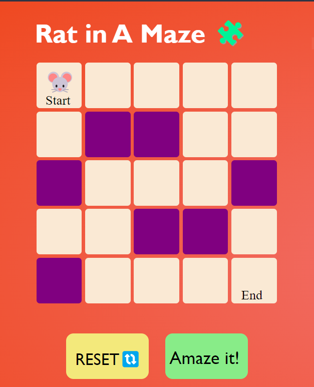
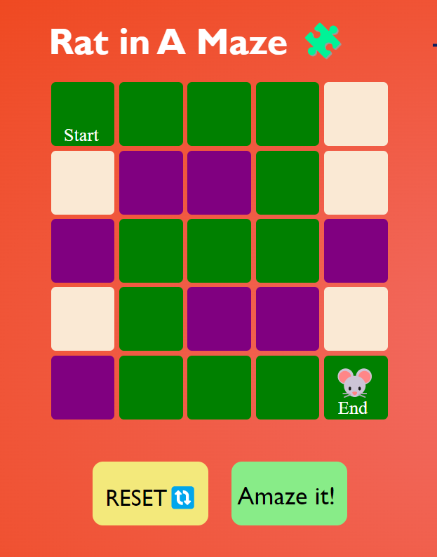

# Rat In A Maze

This Web Application is a Virtual Representation of **DSA** Problem 

 
Uses: `Recursion` `Backtracking`
 
****how it works?****
 
Tap on the boxes to create the hurdles and let the rat find it's path on it's own.

